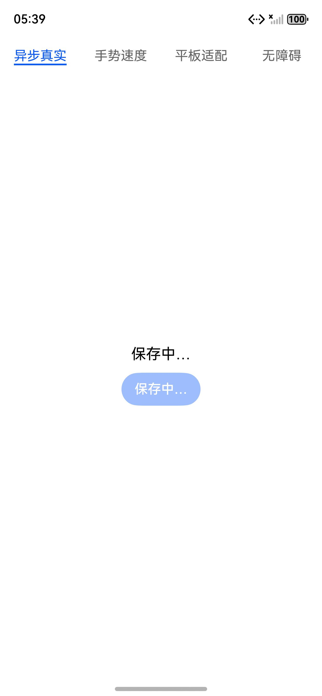
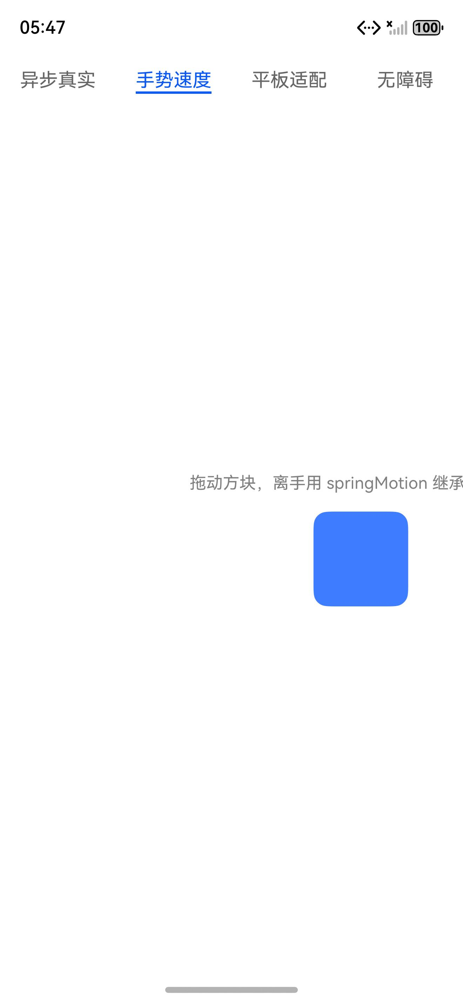
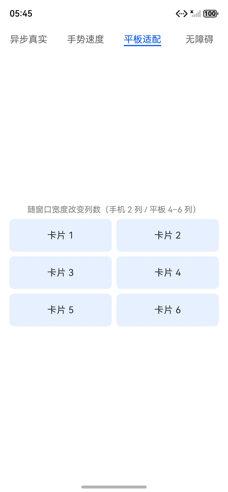
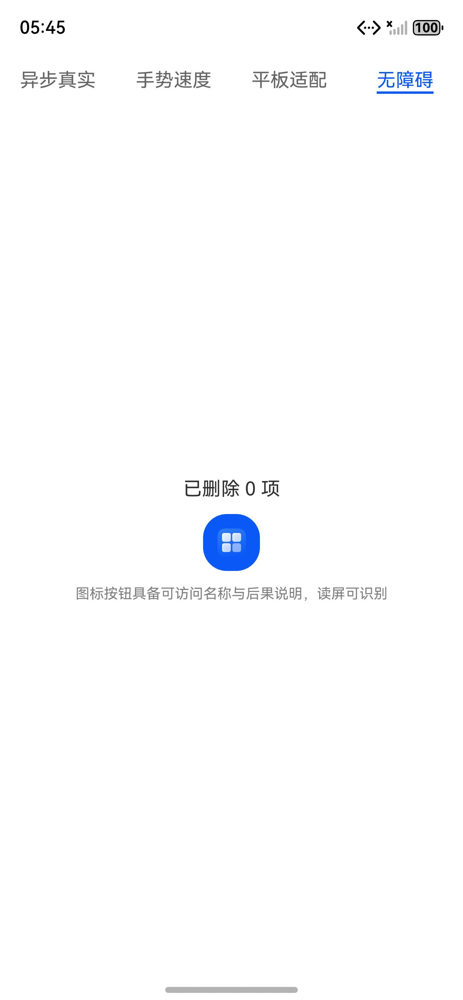

# HarmonyOS-Design

> 面向 AI Coding Agent、HarmonyOS 设计师与 ArkUI 开发者的**独立、非官方**设计与动效 Skill、规则库与评测基线。把公开的 HarmonyOS / OpenHarmony 设计原则和 ArkUI 能力，转化为**可触发、可执行、可验证、可追溯**的产品判断。

**[English README](README.en.md)**


核心命题：

> **一致而不相同，连续而不阻塞，反馈即时但状态真实；基础原则持久、平台表现版本化；系统优先且证据可追溯。**

---

## 快速开始

把所需 Skill 目录复制到支持 Agent Skills 的客户端的 skills 目录：

```bash
git clone https://github.com/dososo/harmonyos-design.git
cp -r harmonyos-design/skills/harmonyos-design            <你的-agent-skills-目录>/
cp -r harmonyos-design/skills/review-harmonyos-design      <你的-agent-skills-目录>/
cp -r harmonyos-design/skills/harmonyos-motion-vocabulary  <你的-agent-skills-目录>/
```

**一句话触发**（Skill 会自动识别并加载）：

```text
帮我审视这段 ArkTS 页面的设计、动效和无障碍
从零做一个鸿蒙平板生产力应用，先建立设计基线和导航方案
这个 ArkUI 卡片拖动松手像急刹车，帮我分析动效
```

---

## 真机运行示例

仓库内含一个可运行的 ArkUI 示例工程 `examples/pilot-app/`，把 Skill 主张的**正确实现**做成 4 个场景，已在 HarmonyOS 模拟器（API 21）真机运行验证：

| 异步状态真实性 | 手势速度衔接 |
| --- | --- |
|  |  |
| 点击→「保存中…」按钮禁用→**真实结果确认后**才「已保存」，成功态不提前 | 拖动跟手，离手用 `springMotion` 继承速度回稳 |

| 平板断点适配 | 无障碍图标按钮 |
| --- | --- |
|  |  |
| `GridRow` 随窗口宽度改列数（手机 2 列 / 平板 4–6 列） | `Button` 承载图标 + `accessibilityText` 可访问名称 |

---

## 为什么做这个 Skill

AI Coding Agent 在 HarmonyOS UI 任务上常见的问题：

1. 把 Android、iOS 或 Web 的动效直接套到 ArkUI；
2. 只关注手机，不问平板、折叠屏、PC、穿戴或输入方式；
3. 生成随机时长和曲线，忽略系统控件已有的按压、焦点、转场；
4. 手势跟手但松手速度归零；动画无法打断或快速连续操作时跳变；
5. 用布局属性做高频动画，引发重排掉帧；
6. **让动效替后端撒谎**——点击就显示「成功」，而请求还没确认；
7. 把项目偏好说成官方规范；
8. 输出大量审美描述，无法直接改代码。

本项目把专家判断压缩为**可触发的 Skill + 可引用的规则 + 可执行的工程建议 + 可验证的评测**，让判断稳定、证据可追溯，而不是「更长的提示词」。

---

## 能解决什么 / 不做什么

**能解决（正向）**

- 审视 ArkTS/ArkUI 的设计、导航、跨设备适配、输入状态、动效、异步真实性、无障碍、性能；
- 从零建立新项目的设计基线、平台版本档案、原型与验收矩阵；
- 把模糊的动效手感（「松手像急刹车」「页面像从同一张卡片长出来」）翻译成准确术语与 ArkUI 落点；
- 每条重要发现带规则 ID、来源等级（H1–H4）、ArkUI 落点和明确结论。

**不做（反向）**

- 不替代官方 HarmonyOS 设计规范，不再分发华为品牌资产；
- 不做完整 ArkUI 组件库、不自动重写整个项目；
- 不把项目偏好冒充官方，不编造 ArkUI API；
- 不处理签名、构建、网络、存储、权限等纯工程问题；
- 不做通用视频剪叙事与生成式视频。

---

## 核心特色

**1 · 三个互补 Skill**

| Skill | 职责 |
| --- | --- |
| `harmonyos-design` | 主 Skill：从零启动、实现指导、现有产品审视（设计/实现/审视三模式，双入口） |
| `review-harmonyos-design` | 严格 Reviewer：只审不改，通过需证据，给规则 ID 与明确结论门槛 |
| `harmonyos-motion-vocabulary` | 动效词汇：把模糊感受映射为精确术语与 ArkUI 能力 |

**2 · 38 条机器可读规则** — 每条带来源、范围、证据、ArkUI 落点、检测方式、稳定性与知识层；JSON Schema 校验，稳定 ID，可供静态扫描与工具接入。

**3 · 异步状态真实性** — 强制区分 `Idle → Acknowledged → Pending → Confirmed / Failed`；成功动效与无障碍播报只能在真实结果确认后出现，绝不提前。

**4 · 反同质化** — 每次设计/审视输出「应保留的产品特征 / 不应套用的通用风格 / 允许的 House Style」，拒绝把所有产品做成同一种玻璃、圆角、弹跳「高级感」。

**5 · 三层知识架构** — 永恒基础层（人因/状态/连续性）、版本化平台层（当前 SDK/API/视觉）、项目覆盖层（品牌/House Style）分离维护；新视觉趋势不覆盖状态真实性与无障碍。

**6 · 真机验证 + 评测基线** — 含 52 条触发 Eval、17 条 Review Eval、13 条 Skill 路由 Eval，以及可运行、已在模拟器验证的 ArkUI 示例工程。

---

## 理念与原则

1. **上下文先于规则**：设备、窗口、输入、API 不明确时，结论必须标注假设。
2. **系统能力优先**：优先系统控件、默认状态、默认转场与 ArkUI 原生动画。
3. **一致而不相同**：跨设备保持任务与架构一致，表现可针对设备优化。
4. **连续而不阻塞**：按下即反馈、手势跟手、离手继速、动画可打断。
5. **反馈即时但状态真实**：成功只在真实结果确认后表达，动画时长不与远端完成耦合。
6. **语义 Token 优先**：不允许散落、无来源的魔法数。
7. **可访问是默认状态**：无障碍、大字体、焦点与低运动策略进入基础检查。
8. **证据高于权威语气**：没有来源时标注推断或项目建议，H3/H4 不冒充官方。
9. **基础原则持久、平台表现版本化**：长期人因原则与当前 HarmonyOS 视觉/API 分层维护。
10. **先原型再定论**：手势、动态与跨端不以静态稿或模型自信替代可运行验证。

---

## 数据与隐私

- **完全离线**：所有校验脚本默认只读、默认无网络，不上传任何代码或数据；
- **不采集**：不收集使用数据，不调用外部服务，不执行被审视项目的未知脚本；
- **不写用户工程**：默认只输出 Findings 与补丁计划，自动修复全部关闭；
- **来源透明**：引用只保留链接、摘要与来源等级，不再分发第三方受版权保护的全文。

---

## 项目结构

```text
harmonyos-design/
├── skills/                      三个 Agent Skill
│   ├── harmonyos-design/        主 Skill + 6 个 references（原则/动效/适配/无障碍/ArkUI映射/来源）
│   ├── review-harmonyos-design/ 严格 Reviewer
│   └── harmonyos-motion-vocabulary/  动效词汇
├── rules/                       规则库
│   ├── harmony-design-rules.yaml  38 条机器可读规则
│   ├── schema.json                规则 JSON Schema
│   └── sources.yaml               来源登记（官方 + 项目自有）
├── evals/                       评测数据
│   ├── trigger-evals.json         52 条触发 Eval
│   ├── review-evals.json          17 条 Review Eval
│   ├── skill-routing-evals.json   13 条 Skill 路由 Eval
│   └── fixtures/                  ArkTS 正反例
├── examples/                    设计案例 + 可运行示例工程 pilot-app/
├── scripts/                     离线校验工具（skills/rules/evals/links/打包）
├── tests/                       单元测试
├── templates/                   案例与规则提案模板
└── assets/screenshots/          真机运行截图
```

---

## 本地验证

```bash
python -m venv .venv && source .venv/bin/activate
pip install -e ".[dev]"

python scripts/validate_repo.py   # 校验 Skill / 规则 / 来源 / Eval
pytest                            # 单元测试
python scripts/check_links.py     # 校验文档内部链接
```

预期：仓库校验通过（Skill 3 / 规则 38 / 来源 26 / Trigger 52 / Review 17 / 路由 13），`pytest` 9 passed。

---

## FAQ

**Q：这是华为官方项目吗？**
不是。本项目是独立、非官方社区项目，与华为及 OpenHarmony 不存在隶属或背书关系。规则明确区分官方来源（H1/H2）与项目建议（H4），不冒充官方。

**Q：规则里的数值（时长、曲线、缩放）是官方标准吗？**
每个数值都标注了类型：官方要求 / 官方参考 / ArkUI 默认 / 观察值 / House Style。例如「按压缩放 0.97」被明确标为项目 House Style，不是官方值。

**Q：Skill 会自动改我的代码吗？**
不会。默认只输出 Findings 与最小修复计划，自动修复全部关闭；需你明确批准后才由外部工具改动。

**Q：支持哪些设备和输入？**
规则覆盖手机、平板、折叠屏、PC、穿戴、智慧屏、车机，以及触摸、鼠标、键盘、手写笔、遥控器、旋钮等输入；每条规则标注适用范围。

**Q：怎么验证一个动效或异步交互？**
Skill 会要求最小可交互原型或真机运行 + 构建、目标设备、快速连续操作、反向打断、慢放、无障碍与帧率证据——构建成功不等于体验通过。

**Q：如何贡献规则或案例？**
见 [CONTRIBUTING.md](CONTRIBUTING.md) 与 `templates/`；新增规则须有明确失败模式与来源，通过 `validate_repo.py` 与 `pytest`。

---

## 关于

**HarmonyOS-Design** 是一个独立、非官方的开源项目，专注把 HarmonyOS / OpenHarmony 的公开设计原则与 ArkUI 实现能力，沉淀为面向 AI Agent 与工程团队的、证据可追溯的设计判断系统。

- 仓库：https://github.com/dososo/harmonyos-design
- 问题与建议：通过 GitHub Issues 提交

HarmonyOS、OpenHarmony、ArkUI、华为及相关名称和商标归各自权利人所有。规则应结合目标 SDK、设备、官方文档和真机结果核验。

---

## License

[Apache License 2.0](LICENSE)
